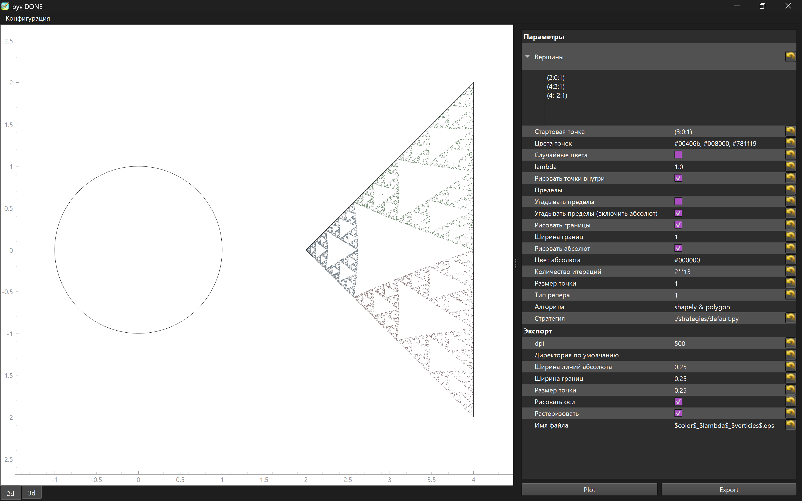

# pyv

Chaos game simulator. Interface is done with pyqtgraph, exporting with matplotlib. So be aware exporting result is not the same as you see on your screen. The reason for this is matplotlib is very slow for real time complex (=with color, many points) plot, so embedding it in interface would cause perfomance issues.

# Installation

Use `uv`:
```console
$ uv sync
```

# Running the Application

```console
$ uv run python src/Gui.py
```
Press "Plot" and contemplate.



# Issues

1. Formats of parameters are in the comments of appropariate methods parse_something in `gui.py`.

# regular $ n $-gon

Build regular $ n $-gon with center in $ c $ and radius $ r $

```python
from cmath import exp
from math import pi

c = complex(0, -3)
r = 2
n = 7

points = [c + r**2 * exp(1j * (2 * pi * k) / n) for k in range(n)]

for z in points:
    print(f'({z.real:.2f}:{z.imag:.2f}:1)')
```
